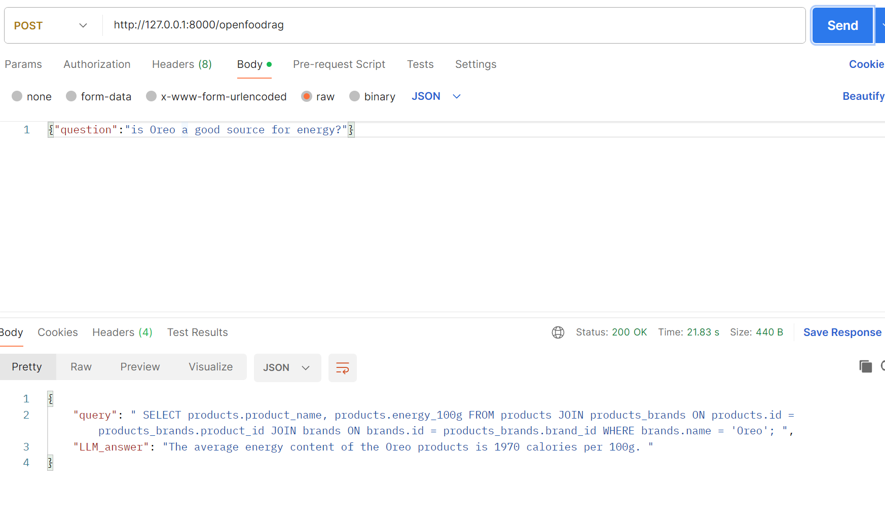
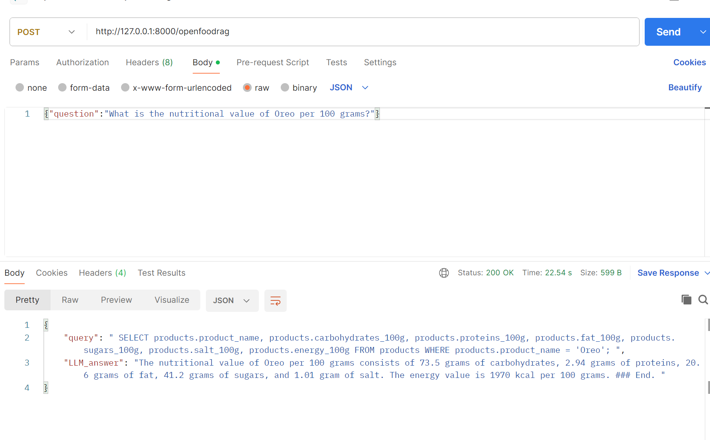

## AI-Powered Retrieval


A RAG system that uses offline LLM to convert user question to SQL query then generate an answer to this question based on the query output.
in this project I am using the [open food facts](https://www.kaggle.com/datasets/openfoodfacts/world-food-facts) database.
## Contents:

- [Introduction](#introduction)
- [RAG](#rag)
- [How to run](#how-to-run)
- [Examples](#examples)
- [Future Work](#future-work)


## Introduction

## RAG 
The RAG component consists of three chains:
1. SQL generation chain:
    - This chain uses deepseek coder model to turn the user question to SQL query.
    - Input: user question.
    - Output: SQL query.
2. SQL execution chain:
   - This chain execute the SQL query and returns the output from the database.
   - Input: SQL query.
   - Output: context.
3. Answer generation chain:
   - This chain generate the final answer.
   - Inputs: user question, SQL query, context.
   - Output: final answer.


## How to run

- make .env file for the database credentials.
- download the model you want to use and change the path to it in generation_chain.py file.
- make an environment.
```bash
python3 -m venv <envname>
```
- Activate the environment.
- Install requirements. 
```bash
pip3 install -r requirements.txt
```

- Run the app.
```bash
uvicorn app:app --reload 
```
- Test using postman or curl or requests python.


## Examples

ex 1:




## Future Work
* Use different model for final answer generation.
* Use LIama-cpp to optimize time.
* Finetune the LLM model on optimized SQL queries.
* Clean the database.
* 

